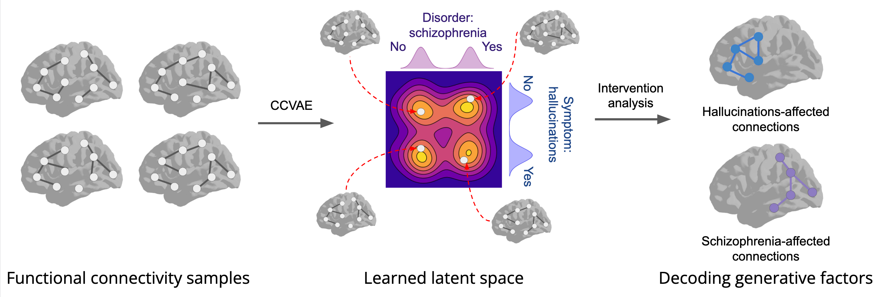

# Learning Generative Factors of Neuroimaging Data with Variational auto-encoders

Official implementation of:

**Learning Generative Factors of Neuroimaging Data with Variational auto-encoders**  
Maksim Zhdanov*, Saskia Steinmann, Nico Hoffmann

https://arxiv.org/abs/2206.01939

**Abstract**: Neuroimaging techniques produce high-dimensional, stochastic data from which it might be challenging to extract high-level knowledge about the phenomena of interest. We address this challenge by applying the framework of generative modelling to 1) classify multiple pathologies, 2) recover neurological mechanisms of those pathologies in a data-driven manner and 3) learn robust representations of neuroimaging data. We illustrate the applicability of the proposed approach to identifying schizophrenia, either followed or not by auditory verbal hallucinations. We further demonstrate the ability of the framework to learn disease-related mechanisms that are consistent with current domain knowledge. We also compare the proposed framework with several benchmark approaches and indicate its advantages.

### Requirements
* PyTorch 1.7.1
* mne 0.23 (for visualization)
